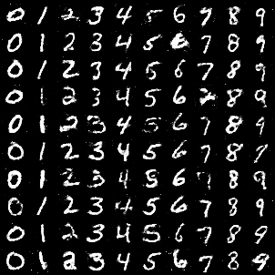

# cGan with DDLS

This is an **unofficial** PyTorch implementation of NIPS2020-paper: 

[Your GAN is Secretly an Energy-based Model and You Should use Discriminator Driven Latent Sampling (Che et al, 2020)](https://arxiv.org/abs/2003.06060)

**Import Note**

I am not one of authors of this paper. This is only a private practice for the educational and academic purposes.

However, the authors do not provide the official training codes (at least I can't find it on the internet). Hence, if this paper does help you and you want to integrate DDLS method into your own project, it's recommended that you take a closer look at `./utils/model.py`.

In `./utils/model.py`, I have encapsulated the whole Discriminator Driven Latent Sampling (DDLS) process as the API of the class of `cGAN`, please check it.

Hope this repositary can help you.


---------------------------------------------------------------------------
## Dependencies

* PyTorch
* torchvision
* numpy
* tqdm
* opencv-python
* imageio
* matplotlib

---------------------------------------------------------------------------
## Discriminator Driven Latent Sampling (DDLS)

Given a nearly optimal Discriminator, $D(x)$, the seminal paper of GAN (Goodfellow et al, 2014) has shown that $D(x) \thickapprox \dfrac{p_d(x)}{p_d(x) + p_g(x)}$,

where $p_d(x)$ denotes the real data distribution and $p_g(x)$ is the implicit distribution contained in the generator.

In this case, we can further derive that 

$\dfrac{p_d(x)}{p_d(x) + p_g(x)} = \dfrac{1}{1+\dfrac{p_g(x)}{p_d(x)}} = \dfrac{1}{1 + \exp(-d(x))} = \bf{sigmoid}(d(x))$, 

where $d(x)$ is the logit of sigmoid function.

This derivation says that, once we have trained our discriminator as optimal as possible (by using SGD), the logit of $D(x)$ gives us the relation between $p_d(x)$ and $p_g(x)$ that $d(x) = -\ln{\dfrac{p_g(x}{p_d(x)}} \Rightarrow p_d(x) = p_g(x)\times e^{d(x)}$.

With this connection, it says that istead of sampling from $p_g(x)$, it will be better that we sample from $p_g(x)\times e^{d(x)}$ (since this term is indeed $p_d(x)$ as long as discriminator is optimal). 

(Noting that the operation of "sampling from $p_g(x)$" is actually that we sample the random noise and feed it into generator, $x = G_\phi(z)$.)

Besides, since $p_g(x)\times e^{d(x)}$ is not well normalized (our logit $d(x)$ may not be exactly optimal in training process), we further consider the corresponding Energy-based Model with the form $p^*_{d}(x) = p_g(x)\times e^{d(x)} / Z_{0} = exp(-E(x)) / Z_0$

Following this insight, however, we will encounter two issues hindering the feasibility.

Doing MCMC and Sampling from $p^{*}_d(x) = p_g(x) \times e^{d(x)} / Z_{0}$ in the high dimensional $x$ space is inefficient and impractical.

2. The even worse issue is, $p_g(x)$ is implicitly defined since all we have is the deterministic function form of $x = G_\phi(z)$.

To address these issues, the paper proposes to sample from latent space $z \sim P(z)$ and adopt Rejection Sampling to achieve the same purpose, as depicted in Section 3.2 of paper.

Furthermore, instead of directly running the Rejection Sampling procedure, the paper explicitly derive the new distribution $p_t(z)$ induced by above Rejection Sampling (see Lemma 1 in the paper).

Finally, the main theorem of paper shows that, once we can sample from $z_t\sim p_t(z)$ and $D(x)$ is nearly optimal, the corresponding distribution of $x_t = G(z_t)$ follows the real data distribution, *i.e.*, $x_t \sim p_d(x)$.

(Here, the energy function, $E(x) = - \ln{(p_g(x)\times e^{d(x)})}$, will calibrate and correct the bias in the generator by re-weighting term $e^{d(x)}$ and normalization term $Z_0$.)

Additionally, since the training of WGAN can also be approximated as the EBM training. The paper analyzes that WGAN can benefit from the proposed DDLS. However, we don't cover it here and leave it in the paper.

The remaining details can be refferd to in the paper.

---------------------------------------------------------------------------
## Training and Testing

We implement the conditional GAN (cGAN) and use MNIST as our dataset.

The script `main.py` is the common entrance for the experiments.

Note that we only implement the normal DDLS process, the part about WGAN training is not contained in this repository.

**Execution**

You can simply run the normal GAN training, as the baseline, with this command:

```markdown
python main.py --mode train --gpu 0
```

On the other hand, you can run the training with proposed DDLS, such as:

```markdown
python main.py --mode train_DDLS --gpu 0 --sgld_step 200
```

The default training setting has already been tuned by myself, so the convergence of training process should be fine.

You still can type `python main.py --help` or check `main.py` to adjust corresponging arguments.

```
optional arguments:
  --help          
  --mode MODE             MODE is either train or train_DDLS
  --gpu 0       
  --lr 0.0001          
  --batch_size 128   
  --optimizer adam
  --sgld_step 50         Performance will be better if you use longer step.
  --sgld_lr 0.01         Used in SGLD process
  --sgld_std 0.1         Used in SGLD process
```

Note 1: You can use Tensorboard to track the training process.

Note 2: For evergy 400 steps (default), it will synthesize data in the log directory for visualization.


---------------------------------------------------------------------------
## Results


The following figures are the visualization results in the training process.

#### Inception Score in Training Process
| baseline | Training with DDLS|
| ---------- | ---------- |
| Inception Score = 2.351 | Inception Score = 2.342 |
| | |

#### Loss_G
| baseline | Training with DDLS|
| ---------- | ---------- |
| | |

#### Loss_D
| baseline | Training with DDLS|
| ---------- | ---------- |
| | |

#### Synthesized Data in training process

| training step 0 (initial)||
| ---------- |--------------|
| baseline | Training with DDLS|
| | |

| step 400||
| ---------- |--------------|
| baseline | Training with DDLS|
| | |

| step 800||
| ---------- |--------------|
| baseline | Training with DDLS|
| | |

| step 1200||
| ---------- |--------------|
| baseline | Training with DDLS|
| | |

| step 1600||
| ---------- |--------------|
| baseline | Training with DDLS|
| | |

| step 8000||
| ---------- |--------------|
| baseline | Training with DDLS|
| | |

| step 20000||
| ---------- |--------------|
| baseline | Training with DDLS|
| | |

Since the MNIST may be trivial in the normal GAN training. The effect of DDLS is not obvious in the experiments above. 

Readers can refer to the paper for the more complete analysis.
